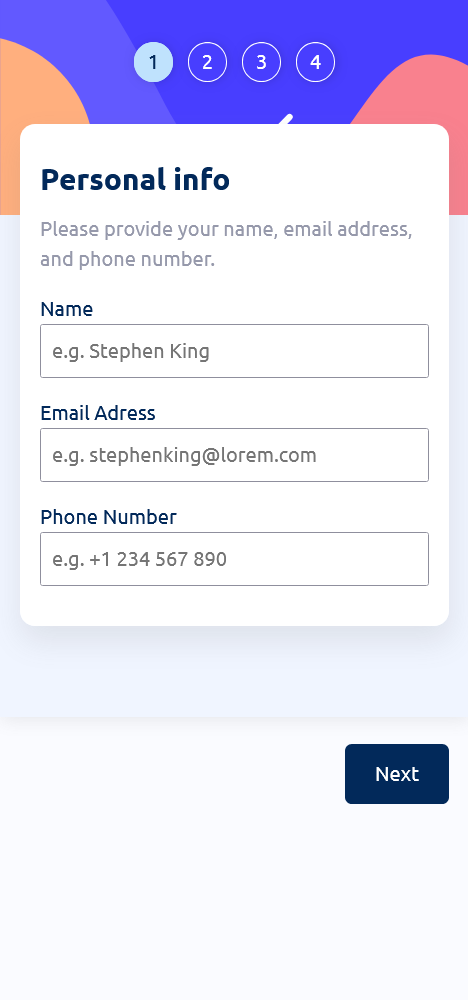
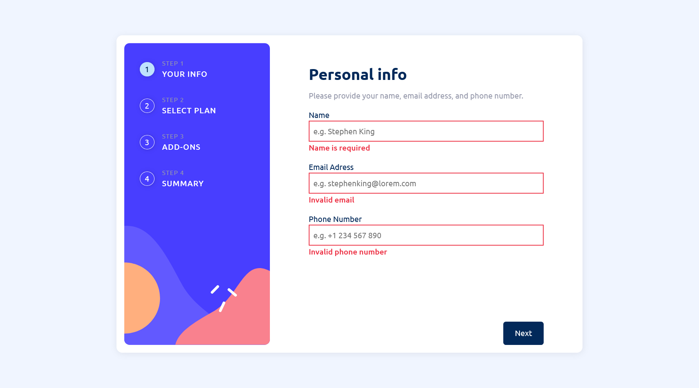
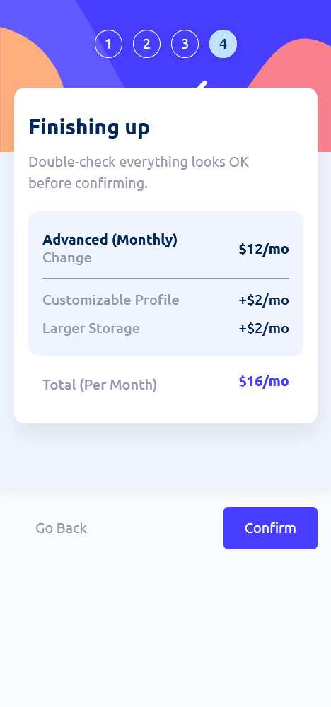

# Multi-Step Form Application

A fully interactive, responsive multi-step form built with React, Vite JSX SSR, and an Express backend. This project demonstrates dynamic form handling, validation, context-based state management, and server-side rendering for performance and SEO.

## Table of contents

* [Overview](#overview)

  * [Features](#features)
  * [Screenshots](#screenshots)
* [My process](#my-process)

  * [Built with](#built-with)
  * [Key learnings](#key-learnings)
  * [Continued development](#continued-development)
  * [Useful resources](#useful-resources)
* [Author](#author)
* [Live Project](#live-project)

---

## Overview

### Features

Users can:

* Progress through multiple steps of a form and submit data sequentially
* Navigate back to previous steps to update selections
* View a summary of all selections before final submission
* Receive immediate validation for required fields and email format
* Experience responsive layout adjustments across devices
* Interact with hover and focus states on all interactive elements
* Submit their selections to the server via a lightweight Express API

The form state is managed via React Context, keeping data accessible across components without prop drilling. Server-side rendering ensures fast initial load times and SEO-friendly markup.

---

### Screenshots





---

## My process

### Built with

* React (Hooks, Context API, useState, useEffect)
* Vite JSX SSR for server-side rendering
* Express for backend API routing and JSON handling
* Vanilla CSS with modular organization
* Flexbox and Grid for responsive layouts
* NanoID for unique identifiers where needed

---

## Key learnings

### 1. **State management with React Context**

Managing multi-step form data centrally allowed seamless navigation between steps without losing input values. Context also made it easy to persist form state for summary and final submission.

### 2. **Form validation and user feedback**

Implemented inline validation for required fields and proper email format. Learned how to conditionally render error messages and prevent invalid submissions while keeping UX smooth.

### 3. **Server-side rendering with Vite JSX SSR**

Handled SSR integration with Vite and Express to serve a fully rendered HTML page for better performance and SEO. This included dynamic template injection and error handling for development and production environments.

Example snippet from server:

```js
const rendered = await render(url);
const html = template
    .replace('<!--app-head-->', rendered.head ?? '')
    .replace('<!--app-html-->', rendered.html ?? '');
res.status(200).set({ 'Content-Type': 'text/html' }).send(html);
```

### 4. **Responsive layout and accessibility**

Optimized layout for mobile and desktop devices, and added focus/hover states for accessibility compliance and polished UI interactions.

---

## Continued development

* Add persistent backend storage for submitted forms
* Implement more complex conditional logic between steps
* Integrate animations for step transitions using Framer Motion
* Add unit and integration tests for form validation and context state
* Expand API to handle multiple form types and advanced submission workflows

---

## Useful resources

* React Docs — [https://react.dev/](https://react.dev/)
* Vite SSR Guide — [https://vitejs.dev/](https://vitejs.dev/)
* MDN Form Validation — [https://developer.mozilla.org/](https://developer.mozilla.org/)
* Express API patterns — [https://expressjs.com/](https://expressjs.com/)

---

## Live project

You can view th live project online here
---

## Author

Created by **Silas**
[GitHub](https://github.com/silaskad)
[LinkedIn](https://www.linkedin.com/in/silas-kiwoy/)
